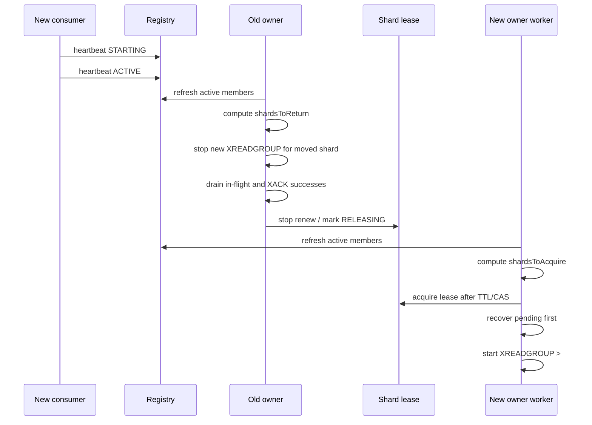

# Redis Stream Sharded Consumer Module 설계

## 0. 고려사항 요약

1. Redis Stream은 Kafka처럼 broker가 partition assignment를 관리하지 않으므로, 애플리케이션 레벨에서 shard ownership을 정해야 한다.
2. 중앙 Group Coordinator를 직접 구현하면 leader election, stale leader fencing, assignment plan 전파, partial rebalance 복구까지 책임져야 하므로 유지보수 비용이 크다.
3. **본 설계는 중앙 Coordinator를 두지 않고, 모든 instance가 같은 synchronized consumer view로 shard owner를 deterministic하게 계산한다.**
4. **shard owner 계산은 Rendezvous Hashing을 기본으로 사용해 scale in/out 시 전체 shard를 재분배하지 않고 변경된 instance와 관련된 shard만 이동시킨다.**
5. **consumer들은 `metadataVersion`, `assignmentConfigVersion`, `membershipEpoch`, 정렬된 active instance 목록을 기준으로 같은 view를 공유해야 한다.**
6. **rolling deploy 중 서로 다른 yaml/config를 가진 instance가 공존할 수 있으므로, shard owner 계산에 영향을 주는 설정은 `assignment_config_version`으로 관리한다.**
7. **`assignment_config_version`이 맞지 않는 instance는 `DEGRADED`로 등록하고 assignment candidate에서 제외한다.**
8. **`active-threads`, batch size, block timeout 같은 local-only 설정은 instance마다 달라도 shard owner 계산에 영향을 주면 안 된다.**
9. **실제 read 권한은 shard lease로 fencing한다. owner로 계산되더라도 lease를 얻지 못하면 `XREADGROUP`을 수행하지 않는다.**
10. **scale in/out 시 shard 반환은 신규 read 중단, in-flight 처리 완료, lease renew 중단, 새 owner acquire 순서로 진행한다.**
11. **graceful handoff가 timeout 안에 끝나지 않으면 lease TTL 만료 후 forced acquire로 전환하고, PEL recovery와 idempotency로 복구한다.**
12. **shard 단위 순서를 보장하기 위해 하나의 shard는 하나의 worker만 읽고, 같은 shard의 handler를 병렬 실행하지 않는다.**
13. **pending recovery도 shard owner의 단일 worker만 수행하며, pending message를 먼저 처리한 뒤 신규 message read를 재개한다.**
14. **consumer delivery는 `XREADGROUP` 후 정상 처리 완료 시 `XACK`하는 at-least-once 방식만 사용한다. `NOACK`은 사용하지 않는다.**
15. **producer retry로 인한 중복 stream entry는 Redis 8.6+ `XADD IDMP {producerName} {idempotencyKey}`로 방지한다.**
16. **`IDMPAUTO`는 사용하지 않고, producer가 business event 단위 idempotency key를 직접 생성하고 retry 시 같은 key를 재사용한다.**
17. **producer, consumer, assignment 계산은 모두 metadata store의 stream metadata를 기준으로 하며, hot path에서는 immutable snapshot cache를 사용한다.**
18. **shard count, partition key schema, partition hash algorithm, assignment algorithm은 같은 stream version 안에서 불변이다.**
19. **shard count나 hash/assignment algorithm을 바꿔야 하면 새 stream version을 만들고 dual-read/write 및 backlog drain 절차로 전환한다.**
20. **metadata store에는 stream metadata, runtime instance registry, processing state, idempotency key, retry/DLQ 기록과 retention 정책이 필요하다.**

---

## 1. Context

Redis Stream을 여러 stream shard로 나누고, 여러 runtime instance가 shard를 중복 없이 나눠 읽도록 지원하는 Spring Boot/Kotlin 공통 모듈을 만든다.

Redis Stream은 Kafka처럼 broker가 partition assignment와 rebalance를 관리하지 않는다.
이전 설계는 Group Coordinator를 두고 leader election, assignment plan 저장, follower 적용까지 구현하는 방향이었다.

대기업 운영 관점에서는 이 구조의 유지보수 비용이 크다.

* coordinator leader election 자체가 장애 지점이 된다.
* assignment plan, coordinator epoch, shard lease, instance state가 서로 맞아야 한다.
* scale-in/out, stale leader, split-brain, partial assignment 적용을 모두 테스트해야 한다.
* Kafka의 group coordinator를 애플리케이션 레벨에서 다시 만드는 형태가 된다.

따라서 본 설계는 중앙 Coordinator를 두지 않는다.
대신 모든 instance가 같은 active member snapshot과 같은 assignment algorithm을 사용해 자신이 맡을 shard를 독립적으로 계산한다.
중복 read 방지는 shard lease가 담당한다.

---

## 2. Goals

* shard 단위 순서 보장
* scale-in/out 시 자동 shard 재분배
* 별도 coordinator leader election 제거
* producer와 consumer가 같은 partitioning metadata를 사용
* rolling deploy 중 서로 다른 설정을 가진 instance가 공존해도 안전하게 동작
* Redis Stream consumer delivery는 `XREADGROUP` + 정상 처리 후 `XACK`
* producer retry 중복은 Redis 8.6+ `XADD IDMP`로 방지
* 운영자가 이해하고 장애 대응할 수 있는 단순한 상태 모델 제공

---

## 3. Non-Goals

* global ordering
* Kafka 수준의 broker-managed consumer group 구현
* 동적 shard-count 변경
* Redis Cluster resharding 자동 대응
* hot shard 자동 split
* 외부 side effect까지 포함한 절대적 exactly-once

---

## 4. Proposed Architecture

```text
Producer
  -> stream metadata cache 조회
  -> partition key hash
  -> stream:{version}:{shardIndex}
  -> XADD IDMP producerName idempotencyKey

Runtime Instance
  -> instance registry heartbeat 등록
  -> active member snapshot 조회
  -> Rendezvous Hashing으로 shard owner 계산
  -> 자신이 owner로 계산한 shard lease 획득
  -> shard별 단일 worker로 XREADGROUP
  -> handler 정상 처리
  -> XACK
```

핵심 정책:

* 중앙 Group Coordinator를 두지 않는다.
* 모든 instance는 같은 metadata snapshot으로 assignment를 독립 계산한다.
* assignment algorithm은 deterministic 해야 한다.
* 하나의 shard는 하나의 runtime instance만 lease owner가 될 수 있다.
* shard owner instance 내부에서도 하나의 shard는 하나의 worker thread만 읽는다.
* 순서 보장은 shard 단위로만 제공한다.
* 실제 read 권한은 shard lease로 fencing한다.
* consumer는 `NOACK`을 사용하지 않는다.

---

## 5. Stream Metadata

producer, consumer, assignment 계산은 모두 metadata store의 stream metadata를 기준으로 한다.
로컬 설정으로 shard count나 hash algorithm을 임의 선택하면 안 된다.

저장 값:

```text
stream_metadata
  stream_prefix
  stream_version
  shard_count
  partition_key_schema
  partition_hash_algorithm
  partition_hash_seed
  assignment_algorithm
  assignment_hash_seed
  stream_key_format
  metadata_version
  state          # ACTIVE, DRAINING, DEPRECATED
  created_at
  updated_at
```

불변 값:

* `shard_count`
* `partition_key_schema`
* `partition_hash_algorithm`
* `partition_hash_seed`
* `assignment_algorithm`
* `assignment_hash_seed`

위 값이 바뀌면 같은 partition key가 다른 shard 또는 다른 owner로 계산될 수 있다.
따라서 같은 `stream_prefix + stream_version` 안에서는 바꾸지 않는다.
변경이 필요하면 새 `stream_version`을 만든다.

metadata 조회 정책:

* producer/consumer는 hot path에서 metadata store를 매번 조회하지 않는다.
* 시작 시 metadata를 로드하고 local immutable snapshot으로 캐시한다.
* `metadata_version` 변경 event 또는 refresh interval로 새 snapshot을 가져온다.
* message의 `streamVersion`, `metadataVersion` 기준으로 해당 버전의 metadata를 검증한다.
* active version만 기준으로 검증하면 v1/v2 dual-read 전환 중 정상 backlog를 오탐할 수 있다.

---

## 6. Producer Routing

```text
metadata = metadataCache.get(streamPrefix, streamVersion)
partitionKey = partitionKeyExtractor(message, metadata.partitionKeySchema)
shardIndex = hash(metadata.partitionHashAlgorithm, metadata.partitionHashSeed, partitionKey) % metadata.shardCount
streamKey = format(metadata.streamKeyFormat, streamPrefix, streamVersion, shardIndex)
```

권장 hash algorithm:

* MurmurHash3
* xxHash
* CRC32C

message에는 routing metadata를 넣는다.

```json
{
  "partitionKey": "user-123",
  "streamPrefix": "notification",
  "streamVersion": "v1",
  "shardIndex": 2,
  "partitionHashAlgorithm": "murmur3",
  "partitionHashSeed": "default",
  "metadataVersion": 4,
  "idempotencyKey": "..."
}
```

순서 보장이 필요한 단위가 있다면 그 값을 partition key로 사용한다.

예:

* userId
* orderId
* aggregateId
* brandId + userId

---

## 7. Producer Idempotency

Redis 8.6 이상에서는 `XADD`의 idempotent 옵션을 사용한다.

```redis
XADD {streamKey} IDMP {producerName} {idempotencyKey} * field value
```

정책:

* `IDMPAUTO`는 사용하지 않는다.
* producer는 publish 전에 idempotency key를 생성한다.
* 같은 business event retry는 같은 idempotency key를 재사용한다.
* 다른 business event는 다른 idempotency key를 사용한다.
* `producerName`은 같은 producer 논리 주체를 나타내는 안정적인 이름이다.
* idempotency key의 보관 기간은 business replay/idempotency 요구사항과 맞춰 운영한다.

---

## 8. Consumer Group

모든 shard stream은 같은 consumer group name을 사용한다.
Redis Stream consumer group은 stream key마다 따로 생성한다.

```redis
XGROUP CREATE notification:v1:0 notification-consumer $ MKSTREAM
XGROUP CREATE notification:v1:1 notification-consumer $ MKSTREAM
XGROUP CREATE notification:v1:2 notification-consumer $ MKSTREAM
```

기본 start id는 `$`이다.
기존 backlog까지 읽어야 하는 경우에만 `0-0`을 사용한다.

consumer name:

```text
{application}:{instanceId}:worker-{workerIndex}
```

예:

```text
order-api:order-api-7f9c9d9d7b-x82kd:worker-0
order-api:host-a:12345:1714700000:worker-1
```

---

## 9. Runtime Membership

### 9.1 Instance Identity

shard assignment의 기준은 `instanceId`이다.

생성 규칙:

* 기본값: `{application}:{hostName}:{processId}:{startTime}`
* 수동 지정: `redis-stream.instance.id`
* platform이 안정적인 instance unique id를 제공하면 그 값을 사용한다.

같은 consumer group 안에서 `instanceId`는 중복되면 안 된다.
중복이 감지되면 나중에 등록한 instance를 `DEGRADED`로 두고 assignment 대상에서 제외한다.

### 9.2 Registry

각 runtime instance는 metadata store 또는 Redis에 heartbeat를 등록한다.

```text
redis-stream:registry:{module}:{consumerGroup}:instances:{instanceId}
```

값 예:

```json
{
  "application": "order-api",
  "instanceId": "host-a:12345:1714700000",
  "configVersion": "2026-05-03.1",
  "assignmentConfigVersion": 3,
  "state": "ACTIVE",
  "lastSeenAt": "2026-05-01T10:00:10Z",
  "metadataVersion": 4
}
```

기본 TTL:

```text
heartbeat-ttl = heartbeat-interval * 3
```

membership registry에 남아 있는 instance 조건:

* heartbeat TTL 안에 갱신됨
* 같은 `streamPrefix`, `streamVersion`, `consumerGroup`을 사용
* metadata version이 호환됨

assignment candidate 조건:

* state가 `ACTIVE`
* heartbeat TTL 안에 갱신됨
* 같은 `streamPrefix`, `streamVersion`, `consumerGroup`을 사용
* metadata version이 호환됨
* assignment config version이 호환됨

`DRAINING` instance는 registry에는 남아 있지만 새 owner 계산에서는 제외한다.
그래야 scale-in 때 다른 instance가 해당 shard의 새 owner로 계산될 수 있다.

### 9.3 Pod Liveness Synchronization

이 모듈은 여러 Pod에 배포되는 것을 기본 전제로 한다.
Pod들은 서로 직접 통신하지 않고, registry heartbeat를 통해 consumer liveness를 동기화한다.

source of truth:

* 각 Pod의 생존 여부는 registry heartbeat TTL로 판단한다.
* 각 Pod의 consume 가능 여부는 registry state와 assignment config 호환성으로 판단한다.
* 각 shard의 실제 read 권한은 shard lease로 판단한다.
* Pod local memory는 cache일 뿐 source of truth가 아니다.

heartbeat loop:

1. Pod 시작 시 `instanceId`를 만든다.
2. stream metadata와 canonical assignment config를 읽는다.
3. config가 호환되면 `STARTING` heartbeat를 쓴다.
4. Redis consumer group과 shard stream 준비가 끝나면 `ACTIVE` heartbeat를 쓴다.
5. 이후 `heartbeat-interval`마다 같은 key를 `PX heartbeat-ttl`로 갱신한다.
6. graceful shutdown이면 먼저 `DRAINING` heartbeat를 쓰고 shard return을 시작한다.
7. shard return이 끝나면 heartbeat key를 삭제하거나 TTL 만료를 기다린다.

liveness refresh loop:

1. 각 Pod는 `membership.refresh-interval`마다 registry snapshot을 읽는다.
2. TTL 안에 있고 assignment candidate 조건을 만족하는 instance만 candidate로 남긴다.
3. candidate `instanceId`를 정렬해 canonical member list를 만든다.
4. `membershipEpoch`을 계산한다.
5. 직전 local view와 `membershipEpoch`이 다르면 rebalance를 트리거한다.

구현 로직:

```kotlin
fun refreshMembership() {
    val snapshot = registry.readInstances(consumerGroup, streamPrefix, streamVersion)
    val candidates = snapshot
        .filter { it.state == ACTIVE }
        .filter { it.notExpired(now) }
        .filter { it.metadataVersion == local.metadataVersion }
        .filter { it.assignmentConfigVersion == local.assignmentConfigVersion }
        .sortedBy { it.instanceId }

    val nextEpoch = hash(
        local.metadataVersion,
        local.assignmentConfigVersion,
        local.assignmentAlgorithm,
        local.assignmentHashSeed,
        candidates.map { it.instanceId }
    )

    if (nextEpoch == currentView.membershipEpoch) {
        staleRegistrySince = null
        return
    }

    if (!stableFor(candidates, rebalance.stabilizationWindow)) {
        return
    }

    currentView = ConsumerView(candidates, nextEpoch)
    reconcileShardOwnership(currentView)
}
```

안정화 규칙:

* 새 Pod는 `ACTIVE` heartbeat가 관측되기 전까지 assignment candidate가 아니다.
* TTL이 만료된 Pod는 다음 refresh부터 assignment candidate에서 제외한다.
* registry 조회 실패 시 기존 view를 즉시 버리지 않는다.
* `membership.max-stale-view`를 넘도록 registry 조회가 실패하면 신규 read를 중단하고 lease renew도 중단한다.
* 짧은 네트워크 흔들림으로 rebalance storm이 생기지 않도록 `rebalance.stabilization-window` 동안 같은 candidate set이 유지될 때만 새 view를 적용할 수 있다.

동기화 보장:

* 모든 Pod가 항상 같은 순간에 같은 view를 볼 필요는 없다.
* 같은 registry snapshot을 본 Pod들은 같은 `membershipEpoch`과 같은 shard owner를 계산해야 한다.
* view 전파는 polling 기반 eventual consistency이다.
* 일시적인 view mismatch는 shard lease CAS로 fencing한다.
* view mismatch 동안 일부 shard가 잠시 미할당될 수는 있지만, owner가 아닌 Pod가 신규 read를 계속하면 안 된다.

Pod readiness/liveness probe 권장:

* liveness probe는 process deadlock 감지용으로만 사용한다.
* readiness probe는 metadata store, Redis, assignment config compatibility가 모두 정상일 때만 성공한다.
* readiness 실패 Pod는 traffic serving과 stream consuming을 분리할 수 있어야 한다.
* stream consuming을 중단해야 하는 경우 registry state를 `DRAINING` 또는 `DEGRADED`로 바꾼다.

### 9.4 Rolling Deploy와 Config Compatibility

rolling deploy 중에는 서로 다른 yaml 설정으로 뜬 instance가 공존할 수 있다.
예를 들어 새 instance는 scale-out 설정을 포함하고 있지만, 기존 instance는 아직 이전 설정으로 동작할 수 있다.
이 구간을 고려하지 않으면 같은 shard에 대해 서로 다른 owner 계산이 발생한다.

설정은 두 종류로 나눈다.

assignment-affecting config:

* `stream-version`
* `assignment.strategy`
* `assignment.hash-seed`
* `membership.heartbeat-ttl`
* `shard-lease.ttl`
* `shard-lease.renew-interval`
* shard ownership 계산에 영향을 주는 모든 값

local-only config:

* `consumer.active-threads`
* `consumer.batch-size`
* `consumer.block-timeout`
* metric/export 설정

정책:

* assignment-affecting config는 yaml만으로 각 instance가 임의 적용하면 안 된다.
* metadata store에 `assignment_config_version`과 canonical assignment config를 저장한다.
* instance는 시작 시 local yaml과 metadata store의 assignment config를 비교한다.
* 다르면 `DEGRADED`로 등록하고 assignment candidate에서 제외한다.
* rolling deploy 중에는 구버전/신버전 instance가 공존할 수 있지만, assignment candidate는 같은 `assignment_config_version`을 가진 instance만 포함한다.
* 최종적으로 모든 instance가 같은 config version으로 수렴한 뒤 새 version을 active로 올린다.

local-only config는 instance마다 달라도 shard owner 계산에 영향을 주지 않는다.
예를 들어 `active-threads`가 instance마다 달라도 자신이 소유한 shard를 내부 worker에 어떻게 나눌지만 달라질 뿐, shard owner 자체는 바뀌면 안 된다.

---

## 10. Coordinatorless Assignment

### 10.1 왜 Coordinator를 제거하는가

중앙 coordinator 방식은 assignment를 한 곳에서 결정한다는 장점이 있지만, 다음 비용이 생긴다.

* leader election 구현
* coordinator lease 갱신
* assignment plan 저장과 전파
* stale leader fencing
* partial rebalance 복구
* follower 적용 상태 추적

이 모듈의 목표는 Redis Stream을 운영 가능한 수준으로 확장하는 것이지, Kafka coordinator를 재구현하는 것이 아니다.
따라서 assignment는 stateless deterministic algorithm으로 계산한다.

### 10.2 Synchronized Consumer View

중앙 coordinator는 없지만 consumer들이 서로 다른 세계를 보고 있으면 안 된다.
따라서 모든 consumer는 같은 기준으로 만든 synchronized view를 사용한다.

synchronized view는 다음 값의 조합이다.

```text
consumerView =
  streamPrefix
  streamVersion
  metadataVersion
  assignmentConfigVersion
  membershipEpoch
  assignmentAlgorithm
  assignmentHashSeed
  activeInstanceIds(sorted)
```

생성 규칙:

* registry snapshot을 읽는다.
* assignment candidate 조건을 만족하는 instance만 고른다.
* `instanceId`를 정렬해 canonical member list를 만든다.
* member list의 hash를 계산한다.
* `membershipEpoch = hash(metadataVersion, assignmentConfigVersion, assignmentAlgorithm, assignmentHashSeed, sortedInstanceIds)`로 만든다.

`membershipEpoch`에는 local clock이나 snapshot 조회 시각을 넣지 않는다.
같은 member list를 본 consumer들이 서로 다른 epoch을 만들면 불필요한 lease churn이 발생한다.

모든 instance는 자기 local view가 바뀔 때만 shard owner를 다시 계산한다.
view가 같으면 assignment 결과도 같아야 한다.

동기화 정책:

* consumer는 `metadataVersion`과 `membershipEpoch`을 shard lease value에 기록한다.
* lease renew 시 현재 local view와 lease의 view가 다르면 renew하지 않는다.
* 새 view에서 자신이 owner가 아닌 shard는 신규 read를 중단한다.
* 새 view에서 자신이 owner인 shard는 lease 획득 후 pending recovery를 먼저 수행한다.
* view 전환 중 중복 read는 lease CAS로 막고, 일시 미할당은 허용한다.

이 방식은 coordinator가 assignment를 push하지 않고도 consumer들이 같은 계산 기준으로 움직이게 만든다.

### 10.3 Assignment Algorithm

기본 algorithm은 Rendezvous Hashing(HRW)이다.

```text
owner(shardIndex) =
  argmax(instance in activeInstances) {
    hash(assignmentHashSeed, streamPrefix, streamVersion, shardIndex, instanceId)
  }
```

특성:

* 모든 instance가 같은 active member snapshot을 보면 같은 owner를 계산한다.
* instance가 추가되면 일부 shard만 새 instance로 이동한다.
* instance가 제거되면 제거된 instance의 shard만 남은 instance로 이동한다.
* 별도 assignment plan 저장이 필요 없다.
* shard count와 instance count가 달라도 자연스럽게 분배된다.

대규모 shard에서 균등성이 부족하면 bounded-load rendezvous hashing을 후속 옵션으로 둔다.
MVP는 plain Rendezvous Hashing을 사용한다.

### 10.4 Snapshot Consistency

모든 instance가 항상 완전히 같은 시점의 member snapshot을 볼 수는 없다.
그래서 assignment 계산 결과만으로 read 권한을 주지 않는다.

정책:

* instance는 자신이 owner라고 계산한 shard에 대해서만 shard lease 획득을 시도한다.
* shard lease를 얻은 instance만 `XREADGROUP`을 수행한다.
* member snapshot이 잠시 달라도 lease CAS가 최종 fencing 역할을 한다.
* snapshot 불일치 동안에는 중복 read 대신 일부 shard가 잠시 미할당될 수 있다.
* 미할당 시간은 heartbeat TTL, lease TTL, scan interval로 제한한다.

### 10.5 Declarative Target Assignment

KIP-848의 핵심은 coordinator가 declarative target assignment를 만들고, 각 member가 자기 current assignment를 target으로 독립적으로 reconcile하는 구조이다.
이 모듈은 Kafka coordinator를 만들지 않지만 같은 모델을 단순화해서 사용한다.

용어 매핑:

```text
group metadata      = stream metadata + assignment config + active instance list
group epoch         = membershipEpoch
target assignment   = Rendezvous Hashing으로 계산한 desired shard owner map
assignment epoch    = membershipEpoch used to compute target assignment
current assignment  = 현재 instance가 lease를 보유하고 처리 중인 shard set
member epoch        = instance가 마지막으로 reconcile에 성공한 membershipEpoch
```

target assignment는 별도 테이블에 저장하지 않는다.
같은 `consumerView`를 가진 모든 Pod가 같은 target assignment를 계산할 수 있어야 한다.

```text
targetAssignment(view) =
  for each shardIndex:
    shardIndex -> owner(shardIndex, view.activeInstanceIds)
```

current assignment는 Pod local worker 상태와 shard lease의 조합이다.

```text
currentAssignment(instanceId) =
  lease.owner == instanceId
  and lease.membershipEpoch == local.memberEpoch
  and worker.state in [READING, RETURNING]
```

member epoch 정책:

* Pod는 새 `membershipEpoch`을 관측하면 target assignment를 다시 계산한다.
* 반환해야 할 shard의 신규 read를 멈추기 전에는 member epoch을 올리지 않는다.
* 반환 대상 shard가 `RETURNING`에 들어가고, 새로 받을 shard acquire loop가 시작되면 local `memberEpoch`을 새 값으로 갱신한다.
* shard lease renew는 lease의 `membershipEpoch`과 local `memberEpoch`이 일치할 때만 허용한다.
* 이 값은 Kafka member epoch처럼 stale member를 fence하는 용도로 사용한다.

이 모델의 목표는 group-wide synchronization barrier 없이 각 Pod가 자기 current assignment를 target assignment로 점진적으로 수렴시키는 것이다.

---

## 11. Scale In / Scale Out

### 11.0 Kafka Rebalance Protocol 적용 원칙

KIP-848의 rebalance protocol에서 가져올 원칙과 버릴 원칙을 분리한다.

참고한 Kafka protocol:

* eager rebalance: 모든 partition을 revoke한 뒤 새 assignment를 받는다.
* cooperative rebalance: 이동해야 하는 partition만 revoke하고, 유지되는 partition은 계속 처리한다.
* next-generation rebalance: target assignment를 선언하고 각 member가 current assignment를 target으로 reconcile한다.

이 모듈의 선택:

* eager 방식은 사용하지 않는다. consumer 하나가 추가될 때 모든 shard를 멈추면 Pod rolling deploy와 scale-out 때 전체 처리량이 떨어진다.
* Kafka broker coordinator는 구현하지 않는다. Redis Stream에는 broker-side group coordinator가 없고, 이를 애플리케이션에서 재구현하면 leader election과 assignment plan 전파가 필요해진다.
* KIP-848의 declarative target assignment와 reconciliation loop 개념은 채택한다.
* 기본 방식은 coordinatorless cooperative rebalance이다. 새 Pod 추가 또는 제거로 owner가 바뀌는 shard만 `RETURNING`으로 전환하고, 나머지 shard는 계속 `READING`한다.

Kafka 개념과 이 모듈의 대응:

```text
Kafka consumer group member    -> runtime instance / Pod
Kafka partition                -> stream shard
Kafka group coordinator        -> 없음
Kafka heartbeat                -> registry heartbeat
Kafka group epoch              -> membershipEpoch
Kafka target assignment        -> Rendezvous Hashing desired owner map
Kafka current assignment       -> current lease owner + worker state
Kafka member epoch             -> local memberEpoch / lease membershipEpoch
Kafka partition revocation     -> shard RETURNING
Kafka partition assignment     -> shard ACQUIRING + lease acquire
Kafka offset commit on revoke  -> processing metadata 기록 + XACK
```

따라서 rebalance는 "전체 정지 후 재할당"이 아니라 "target assignment를 계산하고 shard별 current assignment를 reconcile"하는 방식으로 동작한다.

### 11.1 Rebalance Trigger

rebalance는 별도 coordinator가 명령하지 않는다.
각 instance가 synchronized consumer view 변화를 감지하면 shard owner를 다시 계산한다.

trigger:

* 새 instance heartbeat 등록
* 기존 instance heartbeat TTL 만료
* instance state가 `ACTIVE`에서 `DRAINING`으로 변경
* stream metadata version 변경
* assignment algorithm/seed 변경. 단, 같은 stream version 안에서는 변경 금지

view가 바뀌면 각 instance는 먼저 target assignment를 계산한다.

```text
targetAssignment = targetAssignment(newView)
targetOwnedShards = targetAssignment[instanceId]
currentOwnedShards = currentAssignment(instanceId)

shardsToKeep = currentOwnedShards ∩ targetOwnedShards
shardsToReturn = currentOwnedShards - targetOwnedShards
shardsToAcquire = targetOwnedShards - currentOwnedShards
```

처리 순서:

1. `shardsToKeep`은 기존 member epoch으로 계속 read한다.
2. `shardsToReturn`은 신규 read를 중단하고 `RETURNING`으로 전환한다.
3. local `memberEpoch`을 새 `membershipEpoch`으로 갱신한다.
4. `shardsToAcquire`는 lease 획득을 시도한다.
5. 반환 완료 또는 lease 만료 후 새 owner가 pending recovery를 수행한다.
6. 새 owner가 신규 read를 시작한다.

KIP-848처럼 각 Pod는 target assignment로 독립 수렴한다.
다만 target assignment 저장과 의존성 해소는 Kafka coordinator가 아니라 deterministic assignment와 shard lease CAS가 담당한다.

### 11.2 Shard Return Protocol

shard 반환은 graceful return과 forced return으로 나눈다.

graceful return:

1. worker가 해당 shard를 `RETURNING` 상태로 바꾼다.
2. 해당 shard에 대한 새 `XREADGROUP >` 호출을 중단한다.
3. 이미 읽어 handler 실행 중인 message는 timeout 안에서 완료한다.
4. 성공한 message는 processing metadata를 `PROCESSED`로 기록한 뒤 `XACK`한다.
5. 실패한 message는 retry/DLQ 정책을 따른다.
6. in-flight message가 0이 되면 shard lease renew를 중단한다.
7. 가능하면 lease value에 `state=RELEASING`을 기록하고 TTL을 짧게 줄인다.
8. 새 owner는 release marker를 보고 짧아진 TTL 만료를 기다린 뒤 lease 획득을 시도한다.

forced return:

* process crash, SIGKILL, node failure에서는 graceful return이 불가능하다.
* heartbeat TTL과 shard lease TTL이 만료될 때까지 기존 owner로 간주될 수 있다.
* 새 owner는 lease 획득 후 PEL recovery를 먼저 수행한다.
* 이 경로에서는 at-least-once 재전달이 발생할 수 있으므로 idempotency가 필수이다.

반환 중 금지:

* in-flight handler가 남아 있는데 lease를 즉시 삭제하지 않는다.
* 반환 중인 shard에서 신규 message를 읽지 않는다.
* owner가 아닌 shard의 pending message를 reclaim하지 않는다.
* release marker만 보고 side effect fencing을 생략하지 않는다.

### 11.3 Shard Acquire Protocol

새 owner는 자신이 owner라고 계산한 shard에 대해 lease 획득을 시도한다.

절차:

1. 현재 synchronized view에서 자신이 owner인지 확인한다.
2. 기존 lease가 있으면 TTL 만료 또는 release marker를 기다린다.
3. `SET NX PX`로 shard lease 획득을 시도한다.
4. lease 획득 시 `leaseToken`, `metadataVersion`, `membershipEpoch`을 기록한다.
5. pending recovery를 먼저 수행한다.
6. recovery가 끝나면 `XREADGROUP ... >`로 신규 message read를 시작한다.
7. read loop 중 lease renew 실패 또는 view mismatch가 발생하면 즉시 read를 중단한다.

acquire backoff:

* lease 획득 실패 시 짧은 jitter backoff 후 재시도한다.
* 모든 instance가 동시에 같은 shard에 대해 spin하지 않도록 shard별 backoff를 둔다.
* backoff는 `renew-interval`보다 짧고 `lease-ttl`보다 충분히 작아야 한다.

handoff timeout:

* graceful return이 `handoff-timeout` 안에 끝나지 않으면 기존 owner는 신규 read 중단 상태를 유지하고 lease renew를 중단한다.
* 새 owner는 lease TTL 만료 후 forced acquire 경로로 들어간다.
* timeout 이후 남은 in-flight message는 Redis PEL recovery와 idempotency로 처리한다.

### 11.4 Consumer Join Rebalance Protocol

consumer가 추가될 때의 rebalance는 Kafka cooperative rebalance처럼 이동 대상 shard만 반환하는 단일 프로토콜로 수행한다.
별도 coordinator 명령은 없다.
핵심은 "새 consumer를 active member set에 포함한다", "기존 owner가 이동 대상 shard의 read를 멈춘다", "lease TTL/CAS로 새 owner가 read 권한을 얻는다" 세 단계이다.

consumer는 metadata pub/sub, shard assignment plan 저장, rebalance command 전파를 담당하지 않는다.
consumer가 직접 관리하는 것은 자기 heartbeat, 자기 lease renew, 자기 shard worker 상태뿐이다.

#### 상태

instance state:

```text
STARTING -> ACTIVE -> DRAINING -> STOPPED
STARTING -> DEGRADED
```

shard worker state:

```text
NONE -> ACQUIRING -> RECOVERING_PENDING -> READING -> RETURNING -> NONE
```

의미:

* `STARTING`: metadata store와 assignment config 호환성을 확인하는 중이다. assignment candidate가 아니다.
* `ACTIVE`: shard owner 계산 대상이다.
* `DEGRADED`: config/version mismatch 또는 metadata 조회 실패 상태이다. assignment candidate가 아니다.
* `DRAINING`: 종료 또는 scale-in 대상이다. assignment candidate가 아니다.
* `ACQUIRING`: 새 view에서 자신이 owner인 shard의 lease를 얻는 중이다.
* `RECOVERING_PENDING`: lease 획득 후 기존 pending message를 먼저 회수/처리하는 중이다.
* `READING`: 신규 message를 `XREADGROUP ... >`로 읽을 수 있다.
* `RETURNING`: 더 이상 owner가 아닌 shard의 신규 read를 멈추고 in-flight를 비우는 중이다.

#### Join 절차

새 consumer `C`가 추가되면 다음 순서만 허용한다.

1. `C`는 metadata store에서 stream metadata와 canonical assignment config를 읽는다.
2. local yaml의 assignment-affecting config가 metadata store와 다르면 `DEGRADED`로 heartbeat만 기록하고 consume하지 않는다.
3. config가 같으면 `STARTING` heartbeat를 기록한다.
4. `C`는 Redis consumer group과 stream shard 존재 여부를 확인한다. 필요한 `XGROUP CREATE ... MKSTREAM`은 이미 존재하면 성공으로 처리한다.
5. 준비가 끝나면 `ACTIVE` heartbeat로 전환한다.
6. 모든 consumer는 registry refresh 주기마다 `ACTIVE` instance 목록을 다시 읽는다.
7. `rebalance.stabilization-window`가 설정되어 있으면 같은 candidate set이 그 시간 동안 유지될 때까지 기다린다.
8. `ACTIVE` member list가 바뀌면 각 consumer는 같은 `membershipEpoch`을 계산한다.
9. 각 consumer는 모든 shard에 대해 Rendezvous Hashing으로 `nextOwner(shard)`를 계산한다.
10. 기존 owner는 `shardsToReturn`만 `RETURNING`으로 전환한다.
11. 기존 owner는 `shardsToKeep`을 계속 `READING`한다.
12. 새 owner는 `shardsToAcquire`를 `ACQUIRING`으로 전환한다.

이 절차는 KIP-848의 reconciliation 흐름을 다음처럼 단순화한 것이다.

```text
1. group metadata changed:
   Pod join/leave 또는 metadata 변경으로 membershipEpoch이 바뀐다.

2. target assignment computed:
   각 Pod가 같은 view로 targetAssignment를 계산한다.

3. member reconciliation:
   각 Pod가 currentAssignment와 targetAssignment를 비교한다.

4. revoke first:
   target에 없는 shard만 RETURNING 처리한다.

5. assign incrementally:
   lease가 비워진 shard만 새 owner가 ACQUIRING 처리한다.

6. converged:
   모든 shard lease가 target owner와 새 membershipEpoch을 가진다.
```

중앙 barrier는 없다.
각 Pod가 자기 shard 상태를 reconcile하고, lease CAS가 shard별 dependency를 해소한다.

#### 이동 대상 shard 판정

각 consumer는 자기 관점에서만 다음 값을 계산한다.

```text
currentOwnedShards = 현재 lease를 renew 중이고 worker가 READING 또는 RETURNING인 shard
targetOwnedShards = targetAssignment[newView][self]

shardsToKeep = currentOwnedShards ∩ targetOwnedShards
shardsToReturn = currentOwnedShards - targetOwnedShards
shardsToAcquire = targetOwnedShards - currentOwnedShards
```

중요한 제약:

* `shardsToKeep`은 read를 계속한다.
* `shardsToReturn`은 즉시 신규 `XREADGROUP ... >`를 중단한다.
* `shardsToAcquire`는 lease를 얻기 전까지 절대 read하지 않는다.
* owner 계산 결과가 같아도 lease가 없으면 read 권한이 없다.

구현 로직:

```kotlin
fun reconcileShardOwnership(view: ConsumerView) {
    val currentOwned = shardWorkers
        .filter { it.hasLease && it.state in setOf(READING, RETURNING) }
        .map { it.shardIndex }
        .toSet()

    val targetOwned = allShards
        .filter { shard -> ownerOf(shard, view) == local.instanceId }
        .toSet()

    val shardsToKeep = currentOwned intersect targetOwned
    val shardsToReturn = currentOwned - targetOwned
    val shardsToAcquire = targetOwned - currentOwned

    shardsToKeep.forEach { shardWorkers[it].continueReading() }
    shardsToReturn.forEach { shardWorkers[it].startReturning() }

    local.memberEpoch = view.membershipEpoch

    shardsToAcquire.forEach { startAcquireWorker(it, view) }
}
```

#### 반환 프로토콜

기존 owner가 shard를 반환할 때는 lease를 바로 삭제하지 않는다.

1. shard worker state를 `RETURNING`으로 바꾼다.
2. 해당 shard의 block 중인 `XREADGROUP`은 block timeout 또는 interrupt로 빠져나오게 한다.
3. 반환 시작 이후 해당 shard에 대해 `XREADGROUP ... >`를 다시 호출하지 않는다.
4. 이미 handler에 전달된 message만 처리한다.
5. 정상 처리된 message는 processing metadata 기록 후 `XACK`한다.
6. 실패한 message는 retry/DLQ 정책에 맡기고 ACK하지 않는다.
7. in-flight가 0이 되면 lease renew를 중단한다.
8. lease value를 갱신할 수 있으면 `state=RELEASING`, `nextOwner`, `membershipEpoch`을 기록한다.
9. lease TTL이 만료되면 새 owner가 획득할 수 있다.

반환 중에는 다음을 하지 않는다.

* lease key를 강제로 삭제하지 않는다.
* pending message를 다른 owner에게 직접 넘기지 않는다.
* 같은 shard에 worker를 하나 더 붙이지 않는다.

#### 획득 프로토콜

새 owner는 lease를 얻은 뒤에만 pending recovery와 신규 read를 수행한다.

1. 현재 view에서 `owner(shard) == self`인지 다시 확인한다.
2. 기존 lease가 없으면 `SET NX PX`로 lease를 획득한다.
3. 기존 lease가 있으면 TTL 만료를 기다린다. `RELEASING`은 힌트일 뿐 소유권 양도가 아니다.
4. lease 획득 시 value에 `instanceId`, `workerId`, `leaseToken`, `metadataVersion`, `assignmentConfigVersion`, `membershipEpoch`을 기록한다.
5. shard worker state를 `RECOVERING_PENDING`으로 바꾼다.
6. `XPENDING`/`XAUTOCLAIM`으로 해당 shard의 오래된 pending message를 회수한다.
7. 회수한 pending message를 stream id 순서로 처리한다.
8. pending recovery가 끝나면 shard worker state를 `READING`으로 바꾼다.
9. 그 다음부터 `XREADGROUP ... >`로 신규 message를 읽는다.

pending recovery 기준:

* recovery idle threshold는 `lease-ttl + renew-interval`보다 크게 둔다.
* 새 owner는 lease를 획득한 shard의 pending message만 reclaim한다.
* pending 처리와 신규 read를 같은 shard에서 동시에 수행하지 않는다.

#### 동시성 제어

consumer 추가 시점에 모든 consumer가 같은 millisecond에 같은 view를 보지 못해도 된다.
최종 read 권한은 shard lease CAS가 결정한다.

필수 조건:

* lease renew는 `instanceId`, `leaseToken`, `membershipEpoch`이 모두 일치할 때만 성공한다.
* renew 시 현재 local view에서 자신이 owner가 아니면 renew하지 않는다.
* acquire 시 현재 local view에서 자신이 owner가 아니면 시도하지 않는다.
* view mismatch가 감지되면 해당 shard worker는 즉시 신규 read를 중단한다.

이 조건을 지키면 일시적으로 shard가 비어 있을 수는 있지만, 두 consumer가 동시에 같은 shard의 신규 message를 읽는 상태는 lease CAS로 막는다.

#### Pod Liveness와 Rebalance 관계

Pod liveness 변화는 rebalance의 입력일 뿐이다.
Pod가 다른 Pod에게 직접 shard 반환을 명령하지 않는다.

scale-out:

* 새 Pod가 `ACTIVE` heartbeat를 쓰면 다음 registry refresh에서 member list에 포함된다.
* member list가 바뀌면 모든 Pod가 새 `membershipEpoch`을 계산한다.
* 기존 owner는 새 Pod로 이동해야 하는 shard만 `RETURNING` 처리한다.
* 새 Pod는 자신이 owner로 계산한 shard만 `ACQUIRING` 처리한다.

scale-in:

* 종료 대상 Pod는 먼저 `DRAINING` heartbeat를 쓴다.
* `DRAINING` Pod는 assignment candidate에서 빠진다.
* 남은 Pod들은 새 `membershipEpoch`에서 owner가 된 shard만 획득한다.
* 종료 대상 Pod는 자신이 가진 shard를 `RETURNING` 처리한다.

비정상 종료:

* heartbeat TTL 만료 전까지는 기존 Pod가 살아 있을 수 있다고 본다.
* TTL 만료 후 member list에서 빠지고 새 `membershipEpoch`이 계산된다.
* shard lease TTL 만료 후 새 owner가 lease를 획득한다.
* 새 owner는 pending recovery를 먼저 수행한다.

registry 지연:

* 어떤 Pod는 새 member list를 먼저 보고, 어떤 Pod는 이전 member list를 볼 수 있다.
* 이전 view의 owner가 lease renew를 계속하더라도 새 owner는 lease를 얻지 못하므로 신규 read 중복은 발생하지 않는다.
* 이전 owner가 새 view를 보게 되면 owner mismatch로 renew를 중단한다.
* registry 조회 실패가 `membership.max-stale-view`를 넘으면 해당 Pod는 신규 read와 lease renew를 중단한다.

#### 실패 처리

consumer join 중 실패:

* `STARTING`에서 실패하면 `DEGRADED`로 남고 assignment candidate가 되지 않는다.
* `ACTIVE` 등록 직후 죽으면 heartbeat TTL 만료 후 member list에서 빠진다.
* 이 경우 기존 owner가 이미 반환을 시작했을 수 있으므로, 새 view에서 다시 기존 owner 또는 다른 owner가 lease를 획득한다.

기존 owner 반환 중 실패:

* in-flight message는 ACK되지 않았으면 PEL에 남는다.
* lease TTL 만료 후 새 owner가 lease를 획득한다.
* 새 owner는 pending recovery를 먼저 수행한다.
* delivery는 at-least-once이므로 handler idempotency가 필요하다.

새 owner 획득 후 실패:

* lease renew가 멈추고 TTL이 만료된다.
* 다음 owner가 pending recovery부터 다시 수행한다.

#### 구현 단위

MVP에서 필요한 Redis primitive는 다음으로 제한한다.

* registry heartbeat: `SET key value PX ttl`
* active registry scan: metadata store의 instance registry 조회
* lease acquire: `SET leaseKey value NX PX ttl`
* lease renew: Lua CAS with `instanceId + leaseToken + membershipEpoch + memberEpoch`
* lease release hint: Lua CAS로 `state=RELEASING` 갱신
* pending recovery: `XPENDING`, `XAUTOCLAIM`, `XACK`

별도 rebalance topic, pub/sub listener, assignment plan table은 만들지 않는다.



### 11.5 Scale Out

새 instance가 시작되면 registry에 heartbeat를 등록한다.
다른 instance들은 registry refresh 후 active member set에 새 instance를 포함한다.
Rendezvous Hashing 결과가 바뀐 shard만 이동 대상이 된다.

절차:

1. 새 instance가 `ACTIVE`로 등록된다.
2. 모든 instance가 다음 refresh에서 새 member set을 본다.
3. 기존 owner는 `shardsToReturn`을 계산한다.
4. 기존 owner는 반환 대상 shard의 신규 read를 중단한다.
5. 기존 owner는 in-flight message를 완료한 뒤 lease renew를 중단한다.
6. 새 owner는 `shardsToAcquire`에 대해 lease 획득을 시도한다.
7. 새 owner는 lease 획득 후 pending recovery를 먼저 수행한다.
8. 새 owner는 신규 message read를 시작한다.

### 11.6 Scale In

instance가 정상 종료되면 먼저 `DRAINING` 상태로 바꾼다.

절차:

1. 종료 대상 instance가 registry state를 `DRAINING`으로 바꾼다.
2. `DRAINING` instance는 assignment candidate에서 제외된다.
3. 남은 instance들은 새 view로 owner를 다시 계산한다.
4. 종료 대상 instance는 모든 owned shard를 graceful return한다.
5. 남은 instance들은 반환된 shard lease를 획득한다.
6. 새 owner는 pending recovery 후 신규 read를 시작한다.
7. 종료 대상 instance는 모든 shard 반환 후 heartbeat를 삭제하거나 TTL 만료를 기다린다.

강제 종료:

* heartbeat TTL이 만료되면 active member set에서 빠진다.
* 다른 instance가 제거된 instance의 shard를 owner로 계산한다.
* shard lease TTL 만료 후 새 owner가 lease를 획득한다.
* pending recovery 후 신규 read를 시작한다.

### 11.7 이동량

Rendezvous Hashing은 instance 증감 시 전체 shard를 재분배하지 않는다.
추가/제거된 instance와 관련된 shard만 주로 이동한다.

예:

```text
10 shards / 2 instances
instance-a -> 0, 2, 3, 5, 8
instance-b -> 1, 4, 6, 7, 9

instance-c 추가 후
instance-a -> 0, 3, 8
instance-b -> 1, 4, 7
instance-c -> 2, 5, 6, 9
```

정확한 분배는 hash 결과에 따라 달라진다.
문서나 테스트에서는 특정 예시 값보다 invariant를 검증한다.

검증해야 할 invariant:

* 하나의 shard는 최대 하나의 lease owner만 가진다.
* active instance가 하나 이상이면 모든 shard는 결국 owner를 가진다.
* instance 추가 시 기존 instance 간 shard 이동은 최소화된다.
* instance 제거 시 제거된 instance의 shard만 재할당된다.

---

## 12. Shard Lease

Shard lease는 실제 read 권한이다.

```text
redis-stream:lease:{module}:{consumerGroup}:{streamPrefix}:{version}:{shardIndex}
```

lease value:

```json
{
  "instanceId": "host-a:12345:1714700000",
  "workerId": "worker-0",
  "leaseToken": 42,
  "metadataVersion": 4,
  "assignmentConfigVersion": 3,
  "membershipEpoch": "6d3a...",
  "memberEpoch": "6d3a...",
  "state": "OWNED",
  "expiresAt": "2026-05-01T10:00:20Z"
}
```

정책:

* `SET key value NX PX ttl`로 최초 획득한다.
* renew는 owner와 token이 일치할 때만 Lua로 갱신한다.
* owner가 아니면 갱신하지 않는다.
* renew 시 `metadataVersion`, `assignmentConfigVersion`, `membershipEpoch`, `memberEpoch`이 현재 local view와 같아야 한다.
* lease 갱신 실패 시 해당 shard의 신규 read를 즉시 중단한다.
* graceful return 중에는 lease state를 `RELEASING`으로 바꿀 수 있다.
* `RELEASING`은 새 owner에게 lease TTL 만료가 가까워졌다는 신호를 주기 위한 hint이다.
* lease token과 TTL이 최종 권한 기준이며, release marker만으로 소유권을 넘기지 않는다.
* handler side effect 전후로 가능하면 lease token을 processing metadata에 기록한다.
* lease는 중복 read 시간을 줄이는 fencing 장치이다.
* 최종 중복 side effect 방지는 idempotency와 processing state가 담당한다.

TTL 권장:

```text
lease-ttl >= max(handler-timeout, block-timeout) + renew-jitter-buffer
renew-interval <= lease-ttl / 3
```

---

## 13. Worker Thread Model

`active-threads`는 instance 하나가 Redis Stream consume에 사용할 최대 worker 수이다.

규칙:

* instance가 shard를 하나도 받지 않으면 worker를 만들지 않는다.
* instance가 shard를 받으면 최대 `active-threads`개 worker를 만든다.
* 하나의 shard는 정확히 하나의 worker에만 배정한다.
* 한 worker는 여러 shard를 순차적으로 읽을 수 있다.
* `active-threads > assignedShardCount`이면 남는 worker는 만들지 않는다.
* shard 하나에 worker를 2개 이상 붙이지 않는다.

예:

```text
assigned shards = 6, 7, 8, 9
active-threads = 2

shard 6 -> worker-0
shard 7 -> worker-0
shard 8 -> worker-1
shard 9 -> worker-1
```

순서 보장:

* 같은 shard의 message는 같은 worker에서 순차 처리한다.
* shard 간 순서는 보장하지 않는다.
* 한 shard의 handler를 병렬 실행하지 않는다.

운영 주의:

* worker 하나가 여러 shard를 맡으면 한 shard의 느린 처리가 같은 worker의 다른 shard에도 영향을 줄 수 있다.
* 순서 보장을 유지하면서 격리성을 높이려면 `active-threads >= assignedShardCount`가 되도록 운영한다.

---

## 14. Pending Recovery / Retry / DLQ

Redis Stream은 consumer가 죽으면 message를 PEL에 남긴다.
새 shard owner는 신규 read 전에 pending recovery를 먼저 수행한다.

순서 보장 정책:

* pending recovery도 shard owner의 단일 worker만 수행한다.
* recovery 중에는 해당 shard의 신규 message read를 멈춘다.
* pending message를 먼저 처리하고 ACK한 뒤 신규 message read를 재개한다.
* 처리 실패 message를 건너뛰고 뒤 message를 먼저 ACK하면 shard 내부 순서 보장이 깨질 수 있다.
* max attempts 초과로 DLQ 이동 후 ACK하는 것은 순서 보장을 포기하고 운영 보상 처리로 넘기는 명시적 정책이다.

Recovery:

```redis
XAUTOCLAIM {streamKey} {groupName} {consumerName} {minIdleTime} {startId} COUNT {count}
```

정책:

* `XAUTOCLAIM`은 반환된 next start id로 반복 호출한다.
* next start id가 `0-0`이 될 때까지 한 recovery pass를 계속한다.
* shard owner worker만 해당 shard의 pending message를 reclaim한다.
* retry count가 `max-attempts`를 넘으면 DLQ로 이동한다.
* DLQ 이동 후 원본 message는 ACK한다.
* 이미 metadata store에 `PROCESSED`로 기록된 message는 handler를 다시 실행하지 않고 ACK한다.

Dead consumer cleanup:

1. `XINFO CONSUMERS`로 idle consumer 확인
2. pending이 있으면 먼저 `XAUTOCLAIM`
3. pending이 0이면 `XGROUP DELCONSUMER`

---

## 15. Metadata Store

운영 기본값은 RDBMS(PostgreSQL/MySQL)이다.
Redis Hash/JSON은 로컬 또는 경량 환경에서만 선택한다.

관리할 metadata:

* stream metadata
* runtime instance registry
* shard lease mirror 또는 audit
* message processing state
* idempotency key
* retry count
* DLQ 기록

핵심 테이블 예:

```text
stream_runtime_instance
  consumer_group
  instance_id
  application
  host
  process_id
  state
  metadata_version
  assignment_config_version
  config_version
  last_seen_at

stream_message_processing
  group_name
  stream_key
  message_id
  idempotency_key
  state          # CLAIMED, PROCESSED, FAILED, DLQ
  owner_instance_id
  lease_token
  attempt_count
  updated_at
```

필수 제약:

* `stream_metadata(stream_prefix, stream_version, metadata_version)` unique
* `stream_runtime_instance(consumer_group, instance_id)` unique
* `stream_message_processing(idempotency_key)` unique
* 또는 `stream_message_processing(group_name, stream_key, message_id)` unique

retention:

* `PROCESSED` metadata는 idempotency/replay 보장 기간만큼 보관한다.
* DLQ metadata는 운영 분석 기간만큼 보관한다.
* retention window 없이 무한 보관하지 않는다.

---

## 16. Version Migration

`shard_count`, partition hash algorithm, assignment algorithm을 바꾸려면 새 stream version을 만든다.

예:

```text
notification:v1:0 ~ notification:v1:5
notification:v2:0 ~ notification:v2:11
```

전환 절차:

1. v2 stream metadata를 생성한다.
2. v2 stream과 consumer group을 생성한다.
3. producer dual-write 또는 v2 write 전환을 배포한다.
4. consumer가 v1/v2를 함께 읽도록 배포한다.
5. v1 backlog를 drain한다.
6. v2만 사용한다.
7. rollback window 이후 v1을 deprecated 처리한다.

consumer는 message의 `streamVersion`과 `metadataVersion`으로 해당 metadata snapshot을 조회한다.
active stream version만 기준으로 검증하지 않는다.

---

## 17. Configuration

```yaml
redis-stream:
  enabled: true
  stream-prefix: notification
  stream-version: v1
  consumer-group: notification-consumer

  stream-metadata:
    source: METADATA_STORE
    refresh-interval: 30s
    fail-on-mismatch: true

  config:
    version: "2026-05-03.1"
    assignment-config-source: METADATA_STORE
    fail-on-assignment-config-mismatch: true

  membership:
    heartbeat-interval: 5s
    heartbeat-ttl: 15s
    refresh-interval: 5s
    max-stale-view: 20s

  rebalance:
    protocol: COOPERATIVE
    stabilization-window: 3s
    acquire-backoff-min: 100ms
    acquire-backoff-max: 1s
    handoff-timeout: 30s

  assignment:
    strategy: RENDEZVOUS_HASH
    hash-seed: default

  instance:
    id: null
    identity-source: AUTO

  consumer:
    active-threads: 4
    batch-size: 50
    block-timeout: 2s
    ack-mode: ACK_AFTER_SUCCESS
    ordering: SHARD

  producer:
    idempotency:
      enabled: true
      mode: IDMP
      producer-name: "${spring.application.name}"

  metadata-store:
    type: RDBMS
    transaction-required: true
    claim-timeout: 120s
    processed-retention: 7d

  shard-lease:
    ttl: 20s
    renew-interval: 5s
    handoff-timeout: 30s

  pending:
    reclaim-enabled: true
    min-idle-time: 60s
    scan-interval: 30s
    batch-size: 100

  retry:
    max-attempts: 5

  dlq:
    enabled: true
    suffix: dlq
```

---

## 18. Metrics

최소 metric:

* `redis_stream_active_instances`
* `redis_stream_owned_shards`
* `redis_stream_membership_epoch`
* `redis_stream_assignment_config_version`
* `redis_stream_config_mismatch_total`
* `redis_stream_lease_acquired_total`
* `redis_stream_lease_lost_total`
* `redis_stream_lease_renew_failed_total`
* `redis_stream_shard_returning`
* `redis_stream_shard_acquire_retry_total`
* `redis_stream_shard_handoff_duration`
* `redis_stream_assignment_snapshot_version`
* `redis_stream_messages_read_total`
* `redis_stream_messages_ack_total`
* `redis_stream_messages_failed_total`
* `redis_stream_messages_dlq_total`
* `redis_stream_pending_count`
* `redis_stream_lag`
* `redis_stream_reclaim_total`
* `redis_stream_processed_duplicate_total`
* `redis_stream_processing_claim_failed_total`
* `redis_stream_metadata_refresh_failed_total`

---

## 19. Tradeoffs

### Coordinator 기반 설계

장점:

* assignment 결과가 명시적으로 저장된다.
* 운영자가 현재 plan을 읽기 쉽다.

단점:

* leader election과 stale leader fencing이 필요하다.
* coordinator 장애 처리가 추가된다.
* assignment plan apply protocol이 복잡하다.
* scale-in/out 테스트 범위가 커진다.
* Kafka coordinator를 애플리케이션 레벨에서 다시 구현하게 된다.

### Coordinatorless 설계

장점:

* 중앙 leader가 없다.
* assignment plan 저장이 필요 없다.
* scale-in/out은 active member set 변화와 deterministic hashing으로 처리한다.
* 이동량이 제한적이다.
* 운영과 테스트 표면이 작다.

단점:

* member snapshot이 일시적으로 다르면 일부 shard가 잠시 미할당될 수 있다.
* 현재 owner를 보려면 각 instance의 계산 결과 또는 lease 상태를 봐야 한다.
* 완벽한 균등 분배는 보장하지 않는다.

결론:

MVP와 production baseline은 Coordinatorless 설계를 선택한다.
균등 분배 문제가 실제로 관측되면 bounded-load rendezvous hashing을 추가한다.
중앙 Coordinator는 마지막 선택지로 둔다.

---

## 20. MVP Scope

포함:

* stream metadata 관리
* producer shard routing
* XADD IDMP producer idempotency
* consumer group initialization
* runtime instance registry
* Rendezvous Hashing 기반 coordinatorless shard assignment
* shard lease fencing
* shard 단위 순서 보장
* XREADGROUP + ACK_AFTER_SUCCESS
* XAUTOCLAIM pending recovery
* DLQ
* dead consumer cleanup
* RDBMS 기반 processing metadata
* Micrometer metric

제외:

* 중앙 Group Coordinator
* leader election
* global ordering
* 동적 shard-count 변경
* Redis Cluster resharding 자동 대응
* hot shard 자동 split
* bounded-load rendezvous hashing

---

## 21. References

* NashTech Blog, [Apache Kafka Rebalancing Series: Understanding Kafka Rebalancing Protocols](https://blog.nashtechglobal.com/apache-kafka-rebalancing-series-understanding-kafka-rebalancing-protocols/)
* Apache Kafka Wiki, [KIP-848: The Next Generation of the Consumer Rebalance Protocol](https://cwiki.apache.org/confluence/display/KAFKA/KIP-848%3A+The+Next+Generation+of+the+Consumer+Rebalance+Protocol)
