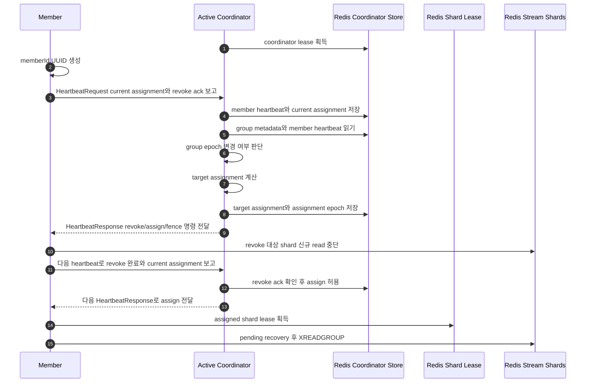
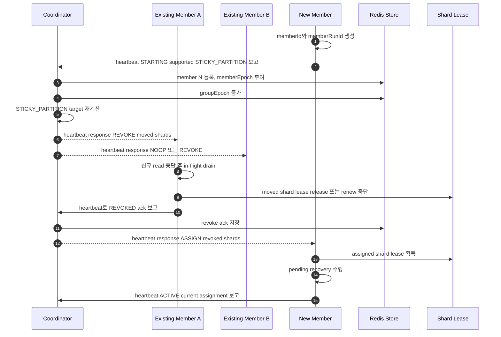
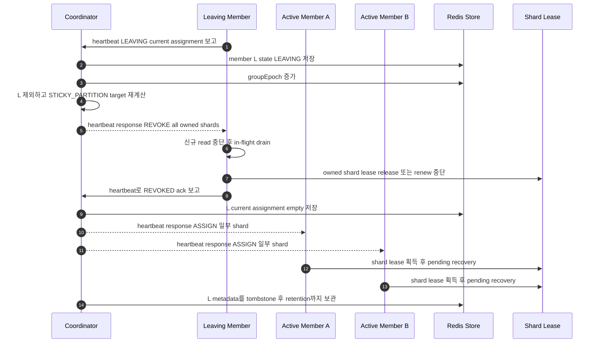
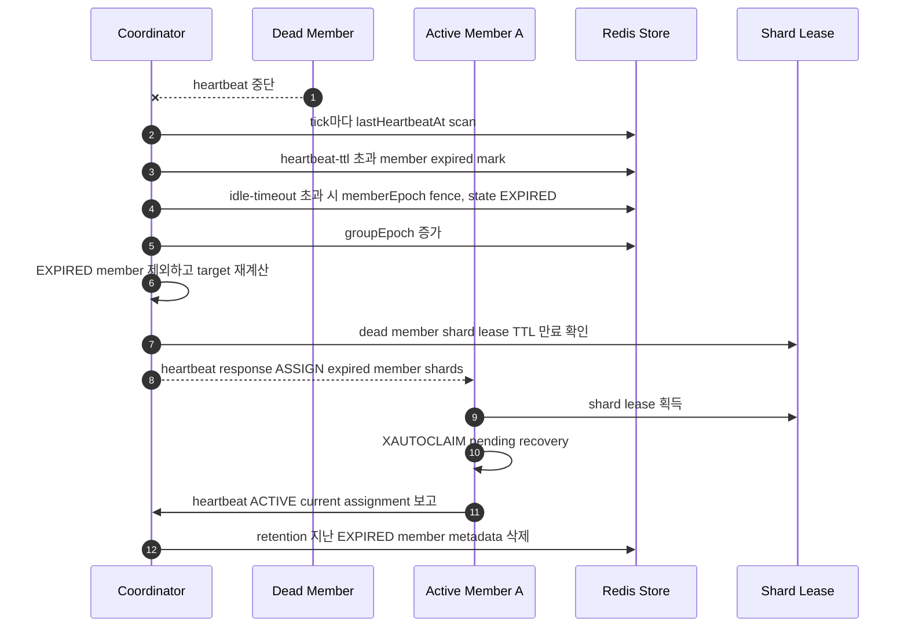
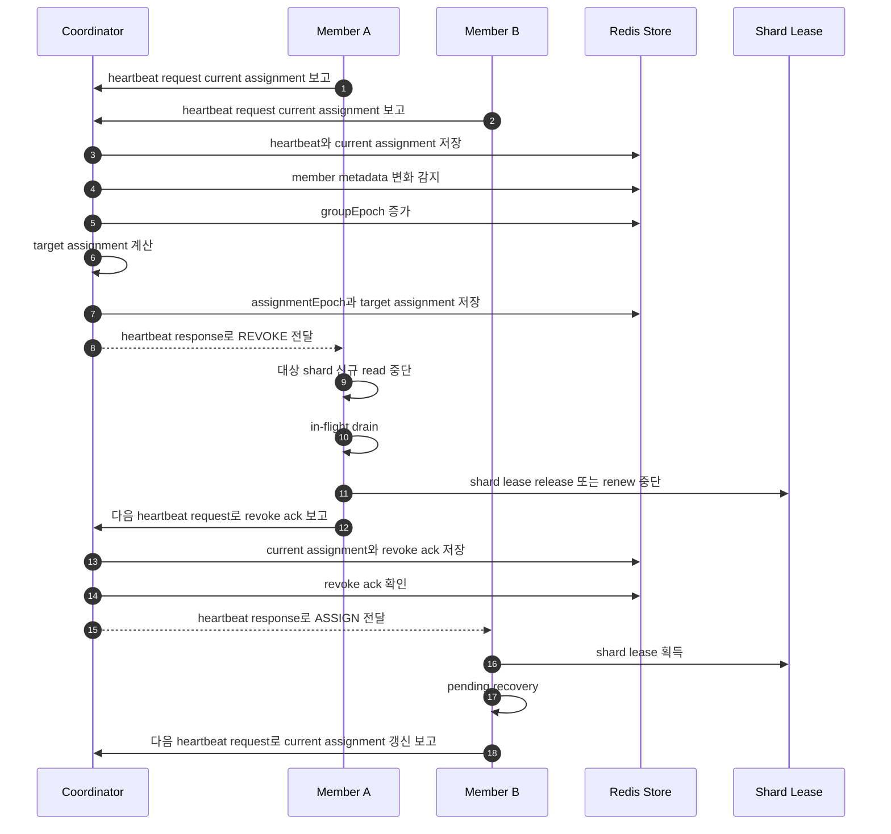

# Coordinator Architecture

## Architecture Summary



## Components

### Coordinator Worker

* `streamPrefix + consumerGroup` 단위 coordinator lease를 획득한다.
* group metadata 변경을 event loop에서 처리한다.
* member heartbeat TTL을 보고 join/leave/fence를 판단한다.
* target assignment를 계산하고 Redis에 저장한다.
* member current assignment를 보고 revoke 완료 여부를 확인한다.
* revoke 완료 전 해당 shard를 새 member에게 assign하지 않는다.

### Coordinator Store

* Redis keyspace에 group metadata, member metadata, target assignment, current assignment, coordinator lease를 저장한다.
* group metadata와 assignment는 durable key이다.
* heartbeat와 ephemeral liveness는 TTL key이다.
* Redis mailbox 구현을 선택하면 heartbeat request와 response를 member별 key로 저장하되, 프로토콜 의미는 direct heartbeat request/response와 동일하게 유지한다.

### Member Runtime

* runtime 시작 시 `memberId` UUID를 만든다.
* heartbeat loop로 현재 상태, current assignment, revocation progress, revoke ack를 보고한다.
* 같은 heartbeat response에서 target epoch, revoke, assign, fence command를 받는다.
* revoke 대상 shard는 신규 read를 멈추고 in-flight를 비운다.
* assign 대상 shard는 shard lease 획득 후 pending recovery부터 수행한다.

### Shard Worker

* `(memberId, streamVersion, shardIndex)` 단위로 동작한다.
* lease token과 member epoch이 유효할 때만 `XREADGROUP`을 수행한다.
* handler 성공 후 processing marker를 기록하고 `XACK`한다.

## Loop Timing

```yaml
redis-stream-coordinator:
  coordinator:
    tick-interval: 1s
    lease-ttl: 10s
    lease-renew-interval: 3s

  member:
    heartbeat-interval: 3s
    heartbeat-ttl: 15s
    idle-timeout: 30s
    metadata-retention: 5m
    rebalance-timeout: 60s

  shard-lease:
    ttl: 20s
    renew-interval: 5s
```

## Coordinator Event Loop

Coordinator는 주기와 이벤트를 함께 사용한다.

```text
coordinator event loop
  every coordinator.tick-interval
  or when heartbeat/metadata/lease event is observed

steps:
  1. coordinator lease renew
  2. group metadata load
  3. member heartbeat scan
  4. idle member expiration and fencing
  5. group epoch bump if metadata changed
  6. target assignment recompute if group epoch changed
  7. revoke/assign dependency resolution
  8. stuck rebalance timeout check
  9. metrics publish
```

## Heartbeat Command Plane

Member와 coordinator 사이의 제어면은 heartbeat 하나로 통일한다. member가 주기적으로 heartbeat를 보내면 coordinator는 그 응답에서 member가 지금 수행해야 할 명령을 내려보낸다.

* request: `memberId`, `memberEpoch`, `metadataVersion`, `supportedAssignmentStrategies`, `currentAssignment`, `revocations`, `capacity`
* response: `status`, `groupEpoch`, `assignmentEpoch`, `memberEpoch`, `metadataVersion`, `commands`, `targetAssignment`
* command는 별도 polling loop로 가져오지 않는다. 다음 heartbeat 응답이 최신 명령이다.
* coordinator failover 중 heartbeat 응답을 만들 수 없으면 member는 기존 lease가 유효한 shard만 계속 처리하고 신규 assign은 받지 않는다.

Heartbeat request 예시:

```json
{
  "protocolVersion": 1,
  "requestId": "hb-member-a-000042",
  "streamPrefix": "summary",
  "consumerGroup": "summary-group",
  "memberId": "member-a",
  "memberRunId": "run-a",
  "memberState": "ACTIVE",
  "memberEpoch": 11,
  "metadataVersion": 8,
  "supportedAssignmentStrategies": ["STICKY_PARTITION"],
  "capacity": {
    "maxConcurrency": 12,
    "availableConcurrency": 8
  },
  "currentAssignment": [
    {
      "streamVersion": "v2",
      "shardIndex": 0,
      "state": "OWNED",
      "leaseToken": "lease-v2-0-a"
    }
  ],
  "revocations": [
    {
      "streamVersion": "v1",
      "shardIndex": 3,
      "state": "DRAINING",
      "inFlight": 2,
      "ackedAt": null
    }
  ],
  "lastAppliedCommandId": "cmd-000041"
}
```

Heartbeat response 예시:

```json
{
  "responseTo": "hb-member-a-000042",
  "status": "OK",
  "groupEpoch": 12,
  "assignmentEpoch": 12,
  "memberEpoch": 11,
  "metadataVersion": 9,
  "targetAssignment": [
    {"streamVersion": "v2", "shardIndex": 0},
    {"streamVersion": "v2", "shardIndex": 2}
  ],
  "commands": [
    {
      "commandId": "cmd-000042",
      "type": "REVOKE",
      "shards": [
        {"streamVersion": "v2", "shardIndex": 1}
      ],
      "deadlineMs": 60000
    }
  ]
}
```

### Heartbeat Request Fields

| Field | Required | Role |
| --- | --- | --- |
| `protocolVersion` | yes | Heartbeat schema version. incompatible version은 `UNSUPPORTED_PROTOCOL`로 거절한다. |
| `requestId` | yes | 중복 응답과 로그 추적용 id. |
| `streamPrefix` / `consumerGroup` | yes | coordinator group 식별자. |
| `memberId` | yes | member runtime이 생성한 UUID. coordinator는 이 id에 member epoch을 부여하고 fencing한다. |
| `memberRunId` | yes | 같은 logical member 이름의 재시작 incarnation 구분값. |
| `memberState` | yes | member lifecycle 상태. |
| `memberEpoch` | yes | member가 현재 적용 중인 assignment epoch. stale 값이면 fenced 또는 retry 대상이다. |
| `metadataVersion` | yes | member가 캐시한 group metadata version. 낮으면 response에 metadata sync 명령이 내려간다. |
| `supportedAssignmentStrategies` | yes | MVP에서는 반드시 `["STICKY_PARTITION"]`이다. 다른 값만 보내면 `UNSUPPORTED_ASSIGNMENT_STRATEGY`로 거절한다. |
| `capacity` | yes | assignment 계산에 사용할 member 처리 용량. `maxConcurrency`는 이 member가 동시에 소유할 shard 상한이다. |
| `currentAssignment` | yes | member가 실제로 lease를 유지하며 처리 중인 shard 목록. |
| `revocations` | yes | revoke 명령을 받은 shard의 drain/ack 진행 상태. |
| `lastAppliedCommandId` | no | member가 마지막으로 적용한 coordinator command id. command 재전송을 idempotent하게 만든다. |

### Heartbeat Response Fields

| Field | Required | Role |
| --- | --- | --- |
| `responseTo` | yes | 어떤 heartbeat request에 대한 응답인지 표시한다. |
| `status` | yes | heartbeat 처리 결과. `OK`가 아니면 member는 command 적용 전 status별 처리를 먼저 한다. |
| `groupEpoch` | yes | coordinator가 본 최신 group metadata epoch. |
| `assignmentEpoch` | yes | target assignment가 계산된 epoch. |
| `memberEpoch` | yes | member가 다음 heartbeat부터 사용해야 하는 epoch. |
| `metadataVersion` | yes | 최신 metadata version. member cache가 낮으면 metadata를 갱신한다. |
| `targetAssignment` | yes | 이 member가 최종적으로 수렴해야 할 shard 목록. |
| `commands` | yes | 이번 heartbeat 응답에서 수행할 revoke/assign/fence 명령 목록. 없으면 빈 배열이다. |

### Heartbeat Enums

`AssignmentStrategy`:

| Value | Role |
| --- | --- |
| `STICKY_PARTITION` | MVP의 유일한 assignment strategy. 기존 owner를 최대한 유지하고, 바뀐 shard만 revoke/assign한다. |

`MemberState`:

| Value | Role |
| --- | --- |
| `STARTING` | member가 기동했고 아직 assignment를 적용하지 않은 상태. |
| `ACTIVE` | heartbeat와 lease renew가 정상이고 assigned shard를 처리 중인 상태. |
| `DRAINING` | graceful shutdown 또는 revoke 처리 중이라 신규 assign을 받지 않는 상태. |
| `LEAVING` | member가 group 탈퇴 의사를 보낸 상태. coordinator는 소유 shard를 revoke 대상으로 만든다. |
| `EXPIRED` | `idle-timeout` 동안 heartbeat가 없어 coordinator가 제거 대상으로 판단한 상태. |
| `FENCED` | coordinator가 이 member epoch을 더 이상 유효하지 않게 만든 상태. member는 read/ack를 중단해야 한다. |

`ShardAssignmentState`:

| Value | Role |
| --- | --- |
| `OWNED` | member가 lease를 가지고 신규 read 가능한 shard. |
| `REVOKING` | coordinator가 revoke를 명령했고 member가 신규 read를 중단해야 하는 shard. |
| `DRAINING` | 신규 read는 중단했고 handler in-flight/Pending 처리를 비우는 중인 shard. |
| `REVOKED` | in-flight가 0이고 lease release 또는 renew 중단까지 끝난 shard. 다음 heartbeat에서 ack로 보고한다. |

`HeartbeatStatus`:

| Value | Role |
| --- | --- |
| `OK` | request가 반영됐고 commands를 적용할 수 있다. |
| `RETRY` | coordinator가 일시적으로 처리하지 못했다. member는 기존 lease 범위만 처리하고 다음 heartbeat에 재시도한다. |
| `COORDINATOR_NOT_ACTIVE` | 응답한 coordinator가 active lease를 잃었다. member는 다른 active coordinator를 찾아 재시도한다. |
| `UNKNOWN_MEMBER` | coordinator가 member를 모른다. member는 registration heartbeat를 다시 보낸다. |
| `STALE_MEMBER_EPOCH` | member epoch이 coordinator state보다 낮다. response의 member epoch과 commands를 기준으로 수렴한다. |
| `UNSUPPORTED_ASSIGNMENT_STRATEGY` | member가 `STICKY_PARTITION`을 지원하지 않는다. coordinator는 assign하지 않는다. |
| `UNSUPPORTED_PROTOCOL` | heartbeat protocol version이 호환되지 않는다. |
| `FENCED` | member가 더 이상 read/ack하면 안 된다. 모든 shard worker를 중단한다. |

`CommandType`:

| Value | Role |
| --- | --- |
| `NOOP` | 수행할 assignment 변경이 없다. heartbeat ack 용도로만 사용한다. |
| `SYNC_METADATA` | member metadata cache를 최신 version으로 갱신하라는 명령. |
| `REVOKE` | 지정 shard의 신규 read를 중단하고 drain 후 revoke ack를 보고하라는 명령. |
| `ASSIGN` | 지정 shard lease를 획득하고 pending recovery 후 read를 시작하라는 명령. |
| `FENCE` | member epoch을 무효화한다. member는 모든 read/ack를 중단한다. |

## Member Scale-Out Sequence

새 member가 추가되면 coordinator는 `STICKY_PARTITION` 기준으로 필요한 shard만 이동시킨다. 기존 owner가 revoke ack를 보내기 전까지 새 member는 해당 shard를 assign받지 않는다.



## Member Scale-In Sequence

정상 scale-in은 member가 `LEAVING` 상태를 heartbeat로 먼저 보고하는 graceful leave로 처리한다. coordinator는 leaving member에게 신규 assign을 주지 않고, 소유 shard를 revoke 대상으로 만든다.



## Idle Member Removal

비정상 종료나 네트워크 단절처럼 member가 `LEAVING`을 보낼 수 없는 경우 coordinator가 idle timeout으로 제거한다.

판정 기준:

* `now - lastHeartbeatAt > heartbeat-ttl`: member를 heartbeat expired로 표시하고 신규 assign 대상에서 제외한다.
* `now - lastHeartbeatAt > idle-timeout`: member를 `EXPIRED`로 전환하고 member epoch을 fencing한다.
* `EXPIRED` member의 shard는 revoke ack를 기다릴 수 없으므로 shard lease TTL 만료 후 새 owner에게 assign한다.
* `metadata-retention`이 지난 `EXPIRED`/empty assignment member metadata는 삭제한다.



## Rebalance Sequence



Revoke/assign 규칙:

* revoke를 받은 member는 해당 shard의 신규 `XREADGROUP ... >`를 즉시 중단한다.
* 이미 handler에 전달한 message는 `rebalance-timeout` 안에서 완료한다.
* in-flight가 0이 되면 lease release 또는 renew 중단 후 revoke ack를 다음 heartbeat에 포함한다.
* coordinator는 revoke ack를 확인하기 전 새 owner에게 assign하지 않는다.
* assign을 받은 member는 shard lease를 획득하고 pending recovery를 먼저 수행한다.
* lease 획득 실패 시 tight loop를 돌지 않고 다음 heartbeat 또는 lease retry backoff까지 기다린다.
* revoking member가 timeout 안에 ack하지 않으면 coordinator는 member를 fenced 처리할 수 있다.

## Coordinator Failover

* active coordinator는 Redis `SET NX PX` lease로 하나만 존재한다.
* lease value에는 `coordinatorId`, `coordinatorEpoch`, `leaseToken`을 기록한다.
* renew 실패 시 coordinator worker는 즉시 assignment write를 중단한다.
* 새 coordinator는 durable group state를 읽고 event loop를 재개한다.
* coordinator failover 중 member는 기존 owned shard만 처리하고 새 assignment는 받지 않는다.
