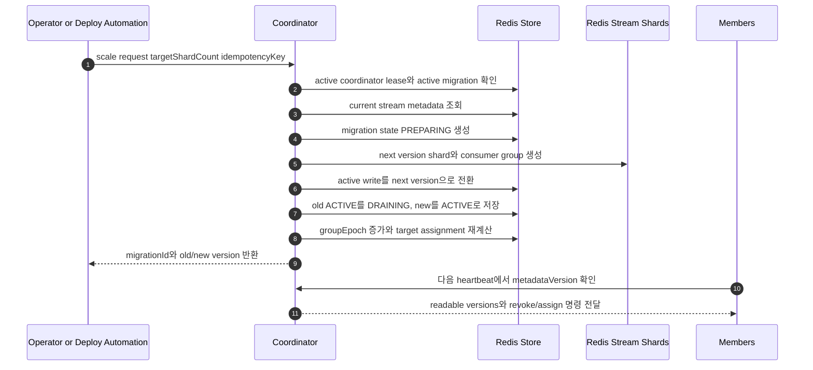

# Stream Version Migration and Routing

## Routing Contract

Producer는 local shard count를 직접 쓰지 않는다.

```text
metadata = metadataCache.activeWrite(streamPrefix)
shardIndex = hash(metadata.hashAlgorithm, metadata.hashSeed, partitionKey) % metadata.shardCount
streamKey = format(metadata.streamKeyFormat, streamPrefix, metadata.streamVersion, shardIndex)
```

## Coordinator Admin Scale Request

Shard count 변경은 member startup이나 `application.yaml` desired spec sync로 시작하지 않는다. 운영자 또는 배포 자동화가 Coordinator Admin API에 scale-out/in을 요청하고, active coordinator가 metadata를 검증한 뒤 migration을 시작한다.



Member startup에서 수행하는 일은 다음으로 제한한다.

* coordinator metadata를 읽어 active write version과 readable versions를 캐시한다.
* 직접 생성한 `memberId`로 heartbeat를 시작한다.
* heartbeat response로 받은 assignment에 대해서만 shard lease를 획득한다.
* local YAML의 shard count를 coordinator에 desired state로 제출하지 않는다.

## Admin API Semantics

초기 group 생성과 shard scale-out/in은 Coordinator Admin API로만 수행한다.

### Create Group

```http
POST /coord/v1/streams/{streamPrefix}/groups/{consumerGroup}
```

```json
{
  "initialShardCount": 12,
  "hashAlgorithm": "murmur3",
  "hashSeed": "default",
  "versionPolicy": "AUTO_INCREMENT",
  "assignmentStrategy": "STICKY_PARTITION",
  "idempotencyKey": "summary-create-20260515-001"
}
```

처리 순서:

1. coordinator lease를 확인한다.
2. group metadata가 없으면 stream version `v1`을 생성한다.
3. `v1` shard stream과 Redis consumer group을 생성한다.
4. `activeWriteVersion=v1`, `readableVersions=[v1]`, `groupEpoch=1`을 저장한다.
5. 이미 같은 idempotency key로 생성된 요청이면 기존 metadata를 반환한다.

### Scale Group

`scale-out`과 `scale-in`은 같은 API의 `targetShardCount` 차이로 표현한다.

```http
POST /coord/v1/streams/{streamPrefix}/groups/{consumerGroup}/scale
```

```json
{
  "targetShardCount": 24,
  "reason": "increase consumer parallelism",
  "requestedBy": "deploy-automation",
  "idempotencyKey": "summary-scale-20260515-001",
  "deprecatedAfter": "P7D"
}
```

Coordinator는 다음 조건을 만족할 때만 요청을 수락한다.

* active coordinator lease를 보유하고 있다.
* 같은 group에 active migration이 없다.
* `targetShardCount`가 현재 active shard count와 다르다.
* `targetShardCount`가 group policy의 min/max 범위 안에 있다.
* 현재 active stream metadata의 hash algorithm과 hash seed가 요청 정책과 호환된다.

요청은 idempotency key로 중복 처리한다. 같은 key와 같은 body는 기존 `migrationId`를 반환하고, 같은 key에 다른 body가 들어오면 conflict로 거절한다.

Response:

```json
{
  "migrationId": "mig-018f8d27",
  "fromVersion": "v1",
  "toVersion": "v2",
  "fromShardCount": 12,
  "toShardCount": 24,
  "state": "PREPARING"
}
```

### Get Metadata

```http
GET /coord/v1/streams/{streamPrefix}/groups/{consumerGroup}
```

반환 값에는 `groupEpoch`, `assignmentEpoch`, `activeWriteVersion`, `readableVersions`, active migration, target/current assignment summary가 포함된다.

### Get Migration

```http
GET /coord/v1/streams/{streamPrefix}/groups/{consumerGroup}/migrations/{migrationId}
```

반환 값에는 old/new version, unread lag, PEL pending, member in-flight, drain progress, stuck revoke 여부가 포함된다.

### Rollback Migration

```http
POST /coord/v1/streams/{streamPrefix}/groups/{consumerGroup}/migrations/{migrationId}/rollback
```

Rollback은 cutover 직후 rollback window 안에서만 허용한다. 이미 new version에 write된 message는 운영 정책에 따라 drain 또는 replay 대상이 된다.

### Authorization and Audit

* create, scale, rollback은 운영 권한이 있는 caller만 호출할 수 있다.
* 모든 admin mutation은 `requestedBy`, `reason`, `idempotencyKey`, `requestedAt`, `coordinatorId`, `coordinatorEpoch`을 audit log로 남긴다.
* coordinator가 active lease를 잃으면 mutation API는 즉시 실패해야 한다.

## Online Migration

```text
old ACTIVE    accepts_writes=true  accepts_reads=true
new PREPARING accepts_writes=false accepts_reads=false

cutover 후

old DRAINING  accepts_writes=false accepts_reads=true
new ACTIVE    accepts_writes=true  accepts_reads=true
```

Coordinator 책임:

* next stream version metadata 생성
* stream shard와 consumer group 생성
* active write pointer 전환
* readable versions 갱신
* group epoch 증가
* target assignment 재계산
* old version drain 완료 후 `DEPRECATED` 전환

Member 책임:

* readable versions에 포함된 shard만 처리한다.
* assigned `ACTIVE`와 `DRAINING` shard를 모두 읽는다.
* `DRAINING` shard는 lag, PEL pending, local in-flight가 0이 될 때까지 drain한다.

## Migration Completion

old version을 `DEPRECATED`로 바꾸려면 다음 조건을 만족해야 한다.

* old version unread lag가 0이다.
* Redis PEL pending이 0이다.
* 모든 member current assignment에서 old version in-flight가 0이다.
* strict key fence를 사용하는 경우 모든 fence가 `NEW_OPEN`이다.
* 최소 retention window가 지났다.

## Rollback Policy

Cutover 직후 문제가 있으면 coordinator는 active write pointer를 old version으로 되돌릴 수 있다. 단, rollback window 안에서만 허용하고 new version에 이미 write된 message는 운영 정책에 따라 drain 또는 replay한다.
