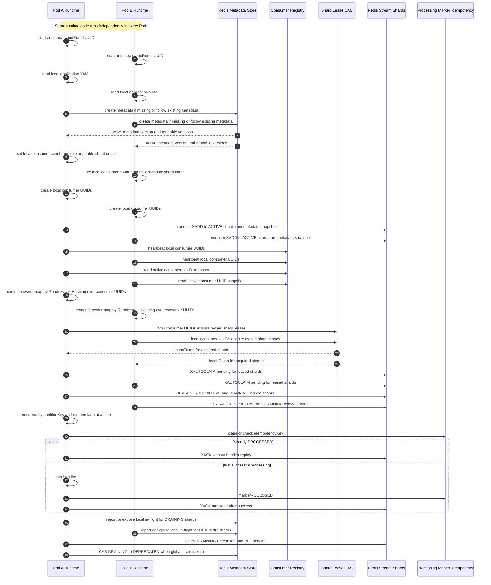
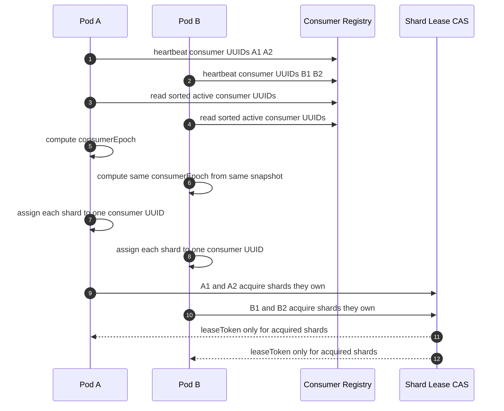
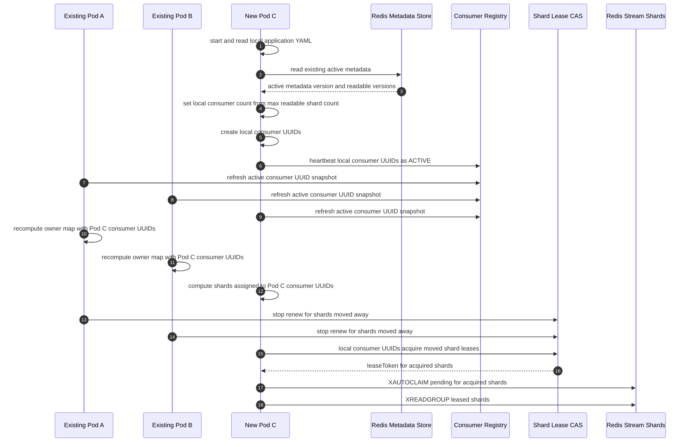
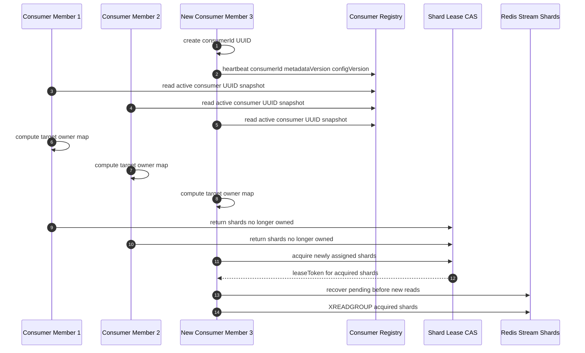
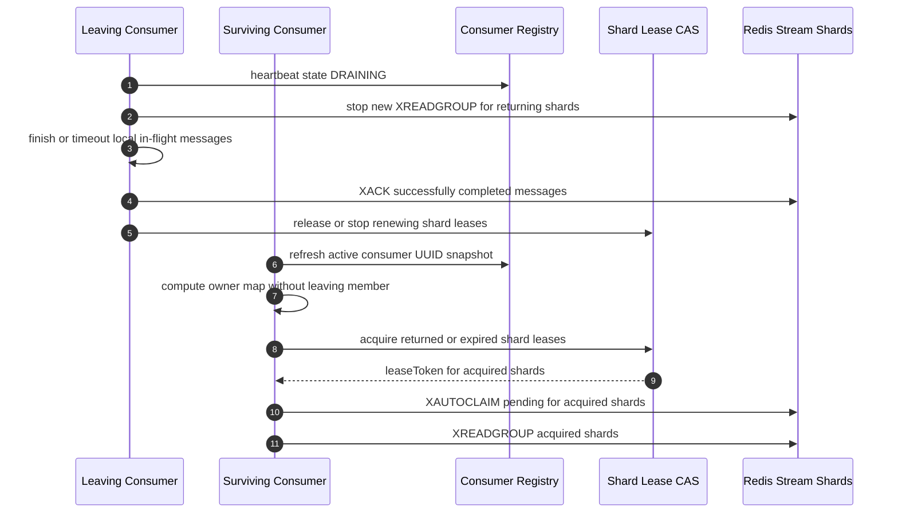
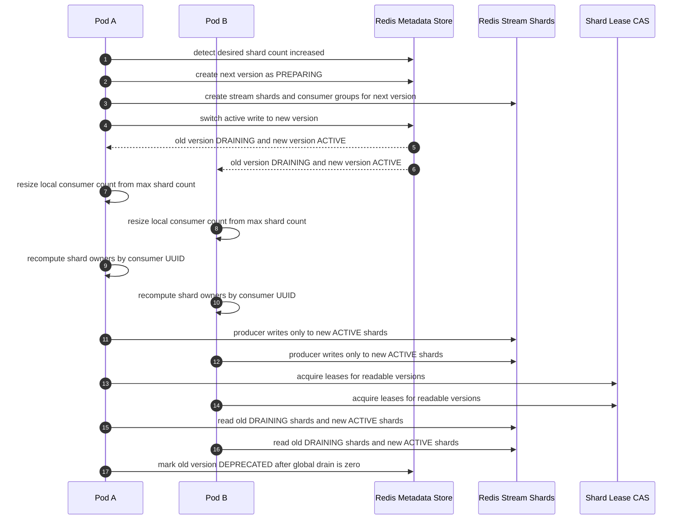
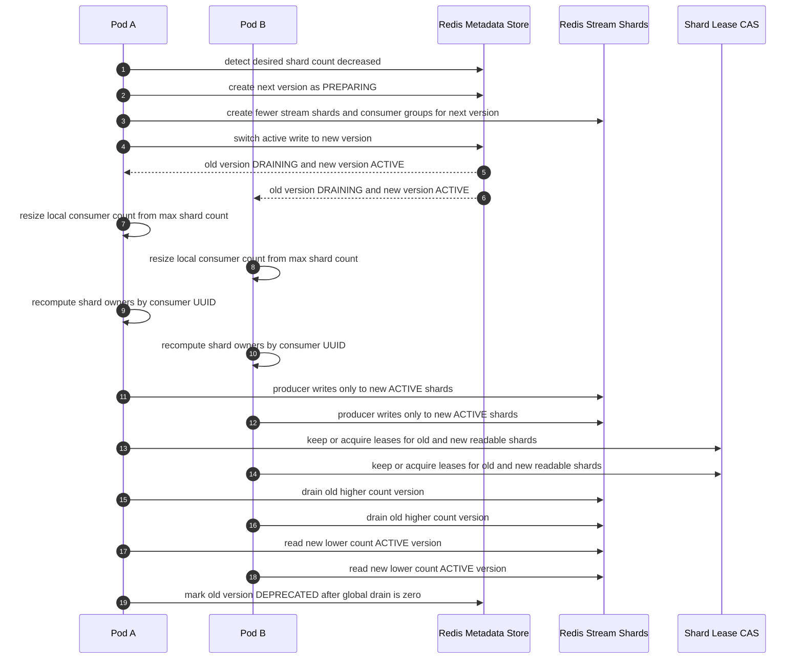

# Proposed Architecture

## Architecture Summary



핵심은 routing metadata, assignment calculation, actual read authority를 분리하는 것이다.

* routing metadata: producer와 consumer가 어떤 stream version, shard count, hash algorithm을 써야 하는지 결정한다.
* assignment calculation: active consumer UUID snapshot을 입력으로 shard별 expected owner를 deterministic하게 계산한다.
* actual read authority: shard lease CAS에 성공한 worker만 `XREADGROUP`을 수행한다.

각 Pod는 metadata reconciliation, snapshot cache refresh, local consumer UUID 생성, registry heartbeat, assignment calculation, shard lease acquire, shard worker 실행을 모두 로컬에서 수행한다. Pod 간 직접 통신은 없고 Redis metadata, registry, lease, stream PEL을 통해서만 상태가 수렴한다.

동기화 지점은 네 가지로 나뉜다.

* metadata sync: `application.yaml` desired spec을 Redis metadata와 비교하고, 없으면 한 Pod만 만들고 이미 있으면 모든 Pod가 같은 immutable metadata version을 따른다.
* membership sync: Pod 내 local consumer UUID heartbeat를 TTL registry에 쓰고, assignment engine은 active consumer UUID snapshot으로 `consumerEpoch`을 계산한다.
* ownership sync: deterministic owner map은 기대 소유자를 계산할 뿐이고, 실제 read 권한은 shard lease CAS와 `leaseToken` 검증으로 확정한다.
* processing sync: idempotency/processing marker로 handler replay를 막고, handler 성공 후 message별 `XACK`로 Redis PEL에서 제거한다.

MVP의 ACK 모델은 Redis Stream의 message-level `XACK`를 그대로 사용한다. Kafka offset commit처럼 shard별 contiguous ACK frontier를 별도 source of truth로 두지 않는다.

## Rebalance Algorithm

Assignment 단위는 Pod가 아니라 Pod 안에서 생성된 local consumer UUID이다. Pod는 metadata sync 후 readable version의 shard count를 보고 local consumer 개수를 정한다.

```text
maxReadableShardCount =
  max(version.shardCount for version in readableVersions)

configuredMaxConcurrency =
  redis-stream.consumer.max-concurrency

effectiveLocalConsumerCount =
  min(configuredMaxConcurrency, maxReadableShardCount)

localConsumerIds =
  create UUID for each local consumer slot in this Pod

consumerEpoch =
  hash(metadataVersion, assignmentConfigVersion, assignmentHashSeed, sorted(activeConsumerIds))

owner(streamVersion, shardIndex) =
  argmax(consumerId in activeConsumerIds) {
    hash(assignmentHashSeed, streamPrefix, streamVersion, shardIndex, consumerId)
  }
```

`configuredMaxConcurrency`가 없으면 `maxReadableShardCount`를 기본값으로 사용한다. `maxReadableShardCount`는 migration 중 `ACTIVE`와 `DRAINING` version이 함께 있을 때 두 version shard count 중 큰 값이다. 합계를 쓰지 않는 이유는 migration 중 local consumer 수가 일시적으로 old+new shard 합계까지 튀는 것을 막기 위해서다. 하나의 local consumer는 필요하면 여러 version shard lease를 가질 수 있다.



## Scenario Diagrams

### New Pod Join

새 Pod도 기존 Pod와 같은 runtime code를 실행한다. 차이는 Redis metadata를 새로 만들지 않고 이미 존재하는 active metadata를 따르며, heartbeat 등록 이후 assignment snapshot에 들어온다는 점이다.



### New Consumer Member Join

새 consumer member는 같은 `streamPrefix`와 `consumerGroup`에 참여하는 새로운 UUID `consumerId`이다. 새 Pod가 만든 local consumer일 수도 있고, 같은 Pod 안에서 concurrency가 늘어나며 추가된 local consumer일 수도 있다.



### Consumer Scale In

scale in은 떠나는 member가 먼저 신규 read를 멈추고 in-flight를 비우는 cooperative return을 시도한다. 강제 종료나 crash는 lease TTL 이후 남은 Pod가 pending recovery로 이어받는다.



### Shard Count Scale Out

shard scale out은 같은 stream version의 shard count를 직접 바꾸지 않는다. 더 큰 shard count를 가진 next version을 만들고 producer write target만 새 version으로 바꾼다.



### Shard Count Scale In

shard scale in도 동일하게 next version migration이다. 감소한 shard count로 새 version을 만들고, old version은 lag와 pending이 0이 될 때까지 read only로 drain한다.



## Component Responsibilities

### Producer

* metadata cache에서 active write version을 읽는다.
* `partitionKey`, `idempotencyKey`를 message metadata에 포함한다.
* `hash(partitionKey) % shardCount`로 shard stream key를 결정한다.
* 같은 business event retry에는 같은 idempotency key를 재사용한다.

### Stream Metadata Manager

* `application.yaml` desired routing spec과 active metadata를 비교한다.
* active metadata가 없으면 `v1`을 CAS insert한다.
* routing spec이 바뀌면 next version을 `PREPARING`으로 만들고 stream/group을 준비한다.
* 준비 완료 후 old active를 `DRAINING`, new version을 `ACTIVE`로 전환한다.
* old `DRAINING` version의 unread lag, Redis PEL pending, local in-flight가 모두 0이 되면 `DEPRECATED`로 전환한다.
* metadata manager는 lifecycle state만 바꾸며, 실제 backlog drain은 shard worker가 수행한다.

### Consumer Registry

* Pod instance가 아니라 local consumer UUID 단위 heartbeat와 state를 저장한다.
* `STARTING`, `ACTIVE`, `DRAINING`, `DEGRADED`, `STOPPED` 상태를 관리한다.
* assignment candidate set을 만들 수 있도록 compatible metadata/config version을 노출한다.
* 중앙 assignment plan을 저장하지 않고 현재 살아 있는 candidate snapshot만 제공한다.

### Local Consumer Runtime

* Pod 시작 시 `podRunId` UUID를 만들고 metadata sync를 수행한다.
* readable version의 최대 shard count를 기준으로 `effectiveLocalConsumerCount`를 계산한다.
* 각 local consumer slot마다 UUID `consumerId`를 만들고 registry heartbeat를 전송한다.
* metadata store는 consumer UUID를 발급하지 않는다. UUID 생성은 Pod 내부에서 하고, metadata sync 이후 registry에 공개한다.
* local consumer count는 `config.consumer.max-concurrency`와 `maxReadableShardCount` 중 작은 값으로 제한한다.
* local consumer UUID는 Pod restart마다 새로 만들며, 재시작 후 ownership은 registry TTL과 lease TTL을 통해 새 view로 수렴한다.

### Assignment Engine

* registry snapshot에서 active consumer UUID list를 만든다.
* `consumerEpoch`을 deterministic하게 계산한다.
* Rendezvous Hashing으로 version별 shard owner consumer UUID를 계산한다.
* current owned shard와 target owned shard 차이를 구해 acquire/return을 트리거한다.

### Shard Lease Manager

* lease acquire: `SET NX PX`
* lease renew: owner/token/epoch CAS
* lease release hint: `RELEASING` state CAS
* lease loss 시 해당 shard의 신규 read를 즉시 중단시킨다.

### Shard Worker

* shard worker는 `(consumerId, streamVersion, shardIndex)` 단위로 실행된다.
* 해당 local consumer UUID가 lease를 가진 shard만 fetch loop를 실행한다.
* `ACTIVE`와 `DRAINING` readable version의 shard를 같은 lease 규칙으로 읽는다.
* `XREADGROUP` 직전과 `XACK` 직전 lease token을 검증해 stale owner의 read/ack를 막는다.
* pending recovery를 신규 read보다 먼저 수행한다.
* message를 `partitionKey` lane scheduler로 전달한다.
* handler 성공 후 processing marker를 기록하고 해당 message를 `XACK`한다.
* `DRAINING` shard는 unread lag, PEL pending, local in-flight가 모두 0이 될 때까지 계속 drain한다.

### Key Lane Scheduler

* 같은 `partitionKey`는 stream id 순서대로 하나씩 처리한다.
* 다른 `partitionKey`는 병렬 처리할 수 있다.
* strict migration mode에서만 old version lane이 닫히기 전 new version lane을 대기시킨다.
* key fence는 cross-version key ordering이 필요한 stream에만 켜는 옵션이며, 모든 stream의 기본 hot path 요구사항은 아니다.

## State Models

### Stream Version State

```text
PREPARING -> ACTIVE -> DRAINING -> DEPRECATED
```

* `PREPARING`: stream/group 생성 중, read/write 금지
* `ACTIVE`: producer write target, consumer read target
* `DRAINING`: producer write 금지, consumer read 허용; lag/pending/in-flight가 0이 될 때까지 drain
* `DEPRECATED`: drain 완료 후 hot path read/write 제외

### Consumer Member State

```text
STARTING -> ACTIVE -> DRAINING -> STOPPED
STARTING -> DEGRADED
```

* `STARTING`: metadata/config 검증 중, assignment candidate 아님
* `ACTIVE`: assignment candidate
* `DRAINING`: graceful shutdown/scale-in 중, assignment candidate 아님
* `DEGRADED`: config mismatch 또는 metadata failure, consume 금지

### Shard Worker State

```text
NONE -> ACQUIRING -> RECOVERING_PENDING -> READING -> RETURNING -> NONE
```

## Intentionally Out of Base Architecture

* shard별 contiguous ACK frontier: Redis `XACK`는 message별로 가능하므로 MVP 기본 경로에서는 별도 frontier store를 두지 않는다.
* 중앙 Group Coordinator 또는 assignment plan table: owner 계산은 deterministic하게 하고 실제 read 권한은 lease가 결정한다.
* hot shard auto split과 Redis Cluster resharding 자동 대응: 운영 고도화 범위로 둔다.
